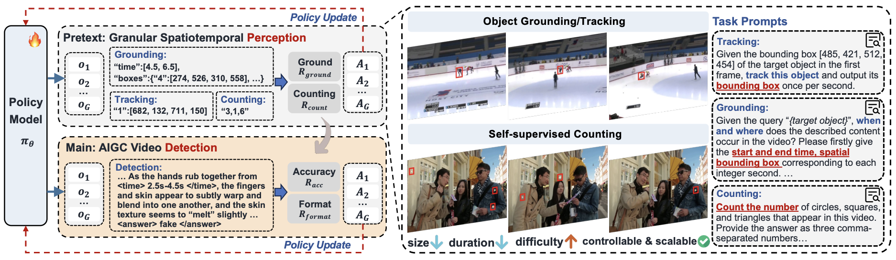

# VideoVeritas:  AI-Generated Video Detection via Perception Pretext Reinforcement Learning

[ 📄[**Paper**](https://arxiv.org/pdf/2602.08828) | 🔗[**Data**](https://www.modelscope.cn/datasets/EricTanh/MintVid) | 🚀[**Model**](https://www.modelscope.cn/models/EricTanh/VideoVeritas) ]

In this work, we introduce:

> 📍**Perception Pretext RL**: an algorithm that leverages simple perception pretext tasks to elevate detection performance. Compatible with R1-paradigm frameworks.
>
> 📍**VideoVeritas Model**: a framework that integrates fine-grained perception and fact-based reasoning for AI-generated video detection.
>
> 📍**MintVid Dataset**: a light yet high-quality AI-generated video dataset that involves three parts: (1) general content, (2) facial, and (3) fact-based videos.

## 📨 Abstract

The growing capability of video generation poses escalating security risks, making reliable detection increasingly essential. In this paper, we introduce **VideoVeritas**, a framework that integrates fine-grained perception and fact-based reasoning. We observe that while current multi-modal large language models (MLLMs) exhibit strong reasoning capacity, their granular perception ability remains limited. To mitigate this, we introduce *Joint Preference Alignment* and *Perception Pretext Reinforcement Learning (PPRL)*. Specifically, rather than directly optimizing for detection task, we adopt general spatiotemporal grounding and self-supervised object counting in the RL stage, enhancing detection performance with simple perception pretext tasks. To facilitate robust evaluation, we further introduce **MintVid**, a light yet high-quality dataset containing 3K videos from 9 state-of-the-art generators, along with a real-world collected subset that has factual errors in content. Experimental results demonstrate that existing methods tend to bias towards either superficial reasoning or mechanical analysis, while VideoVeritas achieves more balanced performance across diverse benchmarks.

<p align="center">
    
</p>


## Installation
```bash
conda create -n videoveritas python=3.10
conda activate videoveritas

# Install the dependencies
pip install -e .
```

## 🔎 Inference on single video
Download [**VideoVeritas**](https://www.modelscope.cn/models/EricTanh/VideoVeritas) 🔥🔥🔥. We recommend using `vLLM` for model deployment:
```bash
sh self_scripts/deploy/deploy_model.sh /path/to/your/model
```
Inference on a single video:
```bash
python self_scripts/infer/infer_vllm_single.py \
--video_path /path/to/your/video
```


## ⌛ Test on MintVid
### 1. Data Preparation
Download the [MintVid](https://www.modelscope.cn/datasets/EricTanh/MintVid) dataset. 
Change the json file path in `./swift/llm/dataset/dataset/data_utils.py` and the video path in the json files.


### 2. Test your MLLMs
```bash
sh self_scripts/infer/infer_mintvid.sh
```


## Citation

If you find our work useful, please cite our paper:

```
@article{tan2026videoveritas,
 	title={VideoVeritas: AI-Generated Video Detection via Perception Pretext Reinforcement Learning},
  author={Tan, Hao and Lan, Jun and Shi, Senyuan and Tan, Zichang and Yu, Zijian and Zhu, Huijia and Wang, Weiqiang and Wan, Jun and Lei, Zhen},
  journal={arXiv preprint arXiv:2602.08828},
  year={2026}
}
```


## License

This repo is released under the [Apache 2.0 License](https://github.com/EricTan7/VideoVeritas/blob/main/LICENSE).

## Acknowledgements
This repo benefits from [ms-swift](https://github.com/modelscope/ms-swift) and [DeepfakeBench](https://github.com/SCLBD/DeepfakeBench). Thanks for their great works!
